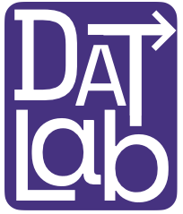

  

  

  

# Development Across Timescales (DAT) Lab

  

### What do we do?

In the DAT lab, we use interdisciplinary approaches to understand develop across multiple timescales, from in-the-moment adaptations in conversation, to language learning across the lifespan, and to cross-generational developments across generations.

---

### Join my Lab!

I am always happy to talk with students who are curious about the intersection of **psychology and computer science** — whether that means studying how people think and learn, building tools to study cognition, or applying computational methods to behavioral data.

If you are a Kenyon student interested in getting involved in research, please reach out! No prior research experience is required. Due to the type of data that we collect and work with, programming skills are very beneficial.

Please fill out this **[interest survey form](https://forms.gle/xM6cNVmArnaFbZik7)**.

Currently recruiting a research assistant to work on a project related to data visualization and text analysis. See the [research tab](projects.html) for what I'm working on.