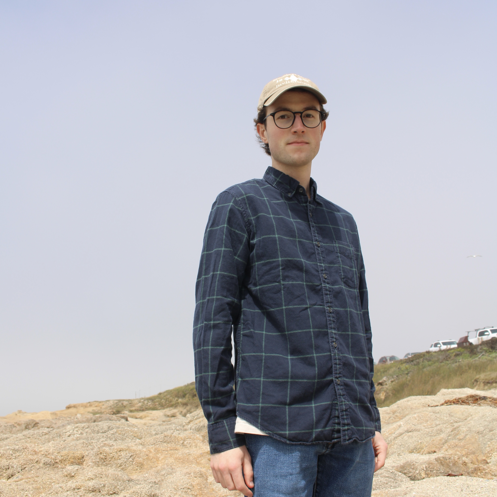

# Ellis Cain

## Academic bio

I am a PhD student in the [Cognitive and Informational Sciences](https://cogsci.ucmerced.edu) program at UC Merced. I am currently working in Dr. Rachel Ryskin's [Language, Interaction, and Cognition Lab](https://linclab0.github.io/). I completed my undergrad at Indiana University in Cognitive Science (B.S.) and East Asian Languages and Culture (Chinese, B.A.). I worked and continue to collaborate in Dr. Chen Yu's [Developmental Intelligence Lab](https://www.la.utexas.edu/users/dil/). I am interested in using NLP methods to explore cognitive science topics like semantic representation and language acquisition.

