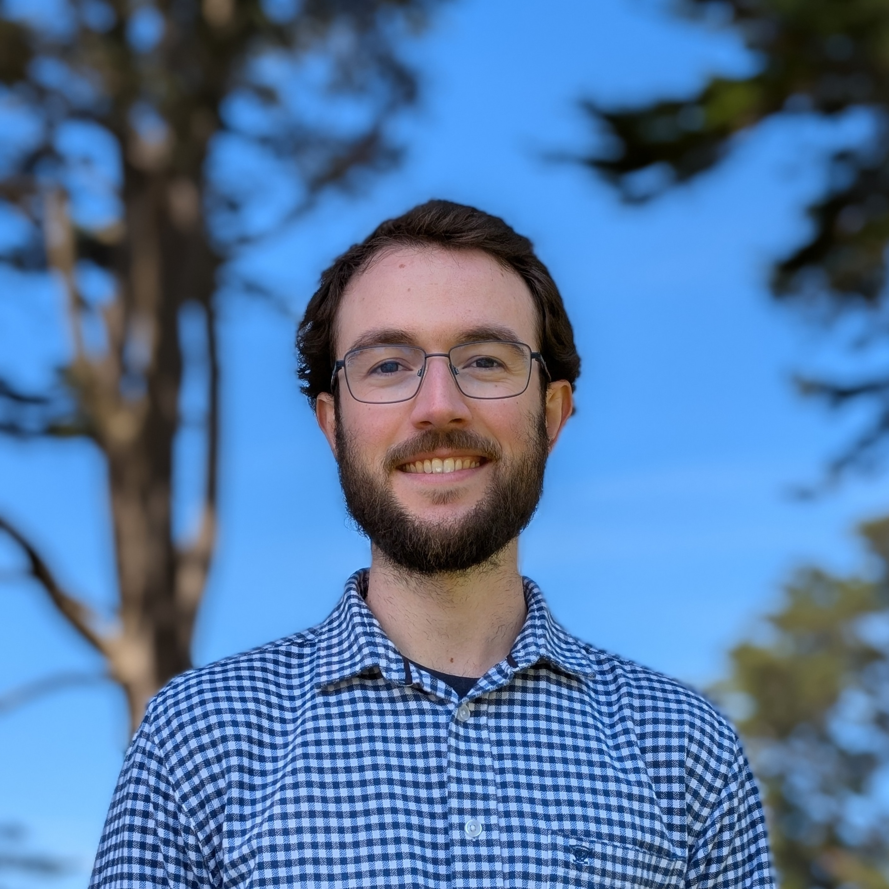

```{r, include=FALSE, echo = F}
library(icons)
library(fontawesome)
```

<style type="text/css">
.title {
  display: none;
}
img {
  border-radius: 200px 200px 200px 200px;
}

</style>

<div style="display: flex; flex-direction: row; gap: 20px;">
  <div class="a" style="flex: 1;text-align: center; padding-top: 70px; padding-right: 10px;padding-left: 10px">



# Ellis Cain, Ph.D.

`cain1@kenyon.edu`

[`r icon_style(academicons("google-scholar"), scale = 2, fill = "#2c3e50")`](https://scholar.google.com/citations?hl=en&user=AMsKqKQAAAAJ) 
[`r icon_style(fontawesome("github"), scale = 2, fill = "#2c3e50")`](https://github.com/ellissc)
[`r fa("bluesky", height = "1.75em", vertical_align = "0em", fill = "#2c3e50")`](https://bsky.app/profile/ellscain.bsky.social) 

  </div>
  <div class="b" style="flex: 2;text-align: justify; text-justify: inter-word;  padding-top: 50px;padding-right: 10px;padding-left: 10px">
  
## Academic bio 

Dr. Ellis Cain is a Postdoctoral Fellow in the [Computing program](https://www.kenyon.edu/academics/departments-and-majors/computing/) at Kenyon College.
His research uses interdisciplinary methodology to explore how individual development (e.g., lifespan learning, cognitive development) and group-level cultural evolution mutually interact and lead to either consistency or divergence in how synchronic age cohorts use and understand language. His current work investigates how this relationship influences the communication patterns of cross-generational conversation dyads. He also studies the stability of semantic information in cultural transmission and the role of shared language in the preservation of narratives.

He graduated from the [Cognitive and Informational Sciences](https://cogsci.ucmerced.edu) program at UC Merced, where he worked in Rachel Ryskin's [Language, Interaction, and Cognition Lab](https://linclab0.github.io/) and collaborated with various professors at UC Merced. He continues to work closely with Rachel on understanding the role of diachronic language change in age-related differences in language processing. During his undergraduate studies, he worked with [Chen Yu](https://www.la.utexas.edu/users/dil/) on verb-specific statistical learning and the ecological validity of cross-situational learning.
  </div>
</div>


